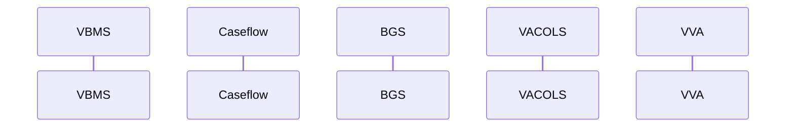

# Caseflow (Caseflow) #2114
Caseflow is a system that will ultimately replace the Veterans Appeals Control and Locator System (VACOLS) as the system of record for appeals. Caseflow will provide functionality to the Board of Veterans' Appeals and other departments/stakeholders to enable the processing and tracking of appeals and related processes. The system will leverage integrations with VA systems to provide functionality that improves the efficiency of working with appeals and other documents, including the VBMS eFolder.
## Data Flow

## Interfacing Systems
|System|Acronym|VASI|
|-|-|-|
|Appeals Modernization - Board of Veterans' Appeals|BVA VACOLS|1721|
|Benefits Enterprise Platform|BEP|1898|
|Common Security Services|CSS|1124|
|IAM - Single Sign-On Internal|SSOi|2346|
|Pexip Video Conferencing Infrastructure|PVCI|2247|
|Veterans Benefits Management System|VBMS|1728|
|Virtual VA|VVA|1775|
## External Interfaces
## Business Functions
### Supported Business Functions
|Hierarchy|Business Function|Description|
|-|-|-|
|1|Provide Services for Veterans and the Public|Provide Services for Veterans and the Public describes the mission and purpose of the Department of Veterans Affairs in terms of the services it provides both to and on behalf of the Veteran and the public.|
|1.1|Process Benefits|Process Benefits is the ability to process or provision benefits and/or services to eligible Veterans and customers through claim establishment, claim development, rating management, and award management.|
|1.1.1|Establish Claim|Establish Claim is the ability to receive a claim, verify a Veteran's service and record, manage folders, and create/establish a new or reopened claim.|
|1.1.1.1|Manage Claimant Record|Manage Claimant Record is the ability to verify service and record, create a new one, or reconcile duplicate or distinct records in support of claims establishment.|
|1.1.1.2|Manage Folder|Manage Folder is the process to manage both physical and electronic folders as evidence for benefits eligibility and entitlement.|
|1.9|Manage Appeals|Manage Appeals includes oversight, processes, and ability to make legal determinations for Veteran appeals. There are three options for an appeal; the first being higher-level review where an elevated de novo review of the decision takes place. The second being a supplemental claim lane where appellates can submit and identify new and relevant evidence to support the appeal. Lastly, an appellate can appeal directly to the Board of Veteran Appeals (BVA) using a direct review, evidence submission, or conduct a hearing.|
|1.9.1|Conduct Decision Reviews|Conduct Decision Reviews involves the intake, review, and determination of requests to review decisions from Veterans through either a supplemental claims or higher-level review adjudication process.|
|1.9.1.1|Conduct Decision Reviews for Supplemental Claims|Conduct Decision Reviews for Supplemental Claims is a function that involves the receipt, processing, and determination of a supplemental claim. The Veteran has the ability to submit or identify new and relevant evidence in support of the claim and the VA provides assistance in developing the evidence.|
|1.9.1.2|Conduct Higher-Level Reviews|Conduct Higher-Level Reviews (HLR) is a function that involves the receipt, processing, and determination of a claim by a higher level claims reviewer. The Veteran has the ability to escalate claims decisions to a more experienced claims adjudicator to conduct higher-level de novo reviews. No new evidence is allowed for submission in this function; however, if a reviewer identifies or learns of a duty to assist error, the claim is returned to the regional office for correction.|
|1.9.2|Adjudicate Appeals to the Board|Adjudicate Appeals to the Board is a service that allows appellant to file a notice of disagreement directly to the Board of Veteran Appeals (Board) and request a Direct Review, an Evidence Submission, or a Hearing.|
|1.9.2.1|Adjudicate Appeals via Direct Review|Adjudicate Appeals via Direct Review is a function that enables appellant to submit a Notice of Disagreement (NOD) for a direct review by the Board, which excludes the need for additional evidence or a hearing. Average decision time = 365 days.|
|1.9.2.2|Adjudicate Appeals via Evidence Submission|Adjudicate Appeals via Evidence Submission is a function that enables appellant to submit a Notice of Disagreement (NOD) for a review by the Board with additional evidence provided.|
|1.9.2.3|Adjudicate Appeals via Hearing|Adjudicate Appeals via Hearing is a function to schedule, conduct, and hold a hearing based on appellant submitting a Notice of Disagreement (NOD) and requesting to be heard before a Veterans Law Judge.|
