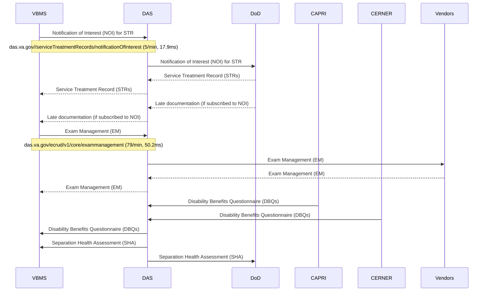

## Data Flow

```mermaid
sequenceDiagram
    participant VBMS
    participant DAS
    participant DoD
    participant CAPRI
    participant CERNER
    participant Vendors
    VBMS->>DAS: Notification of Interest (NOI) for STR
    Note over VBMS,DAS: das.va.gov//serviceTreatmentRecords/notificationOfInterest (5/min, 17.9ms)
    DAS->>DoD: Notification of Interest (NOI) for STR
    DoD-->>DAS: Service Treatment Record (STRs)
    DAS-->>VBMS: Service Treatment Record (STRs)
    DoD-->>DAS: Late documentation (if subscribed to NOI)
    DAS-->>VBMS: Late documentation (if subscribed to NOI)
    VBMS->>DAS: Exam Management (EM)
    Note over VBMS,DAS: das.va.gov/ecrud/v1/core/exammanagement (79/min, 50.2ms)
    DAS->>Vendors: Exam Management (EM)
    Vendors-->>DAS: Exam Management (EM)
    DAS-->>VBMS: Exam Management (EM)
    CAPRI->>DAS: Disability Benefits Questionnaire (DBQs)
    CERNER->>DAS: Disability Benefits Questionnaire (DBQs)
    DAS->>VBMS: Disability Benefits Questionnaire (DBQs)
    DAS->>VBMS: Separation Health Assessment (SHA)
    DAS->>DoD: Separation Health Assessment (SHA)
```
