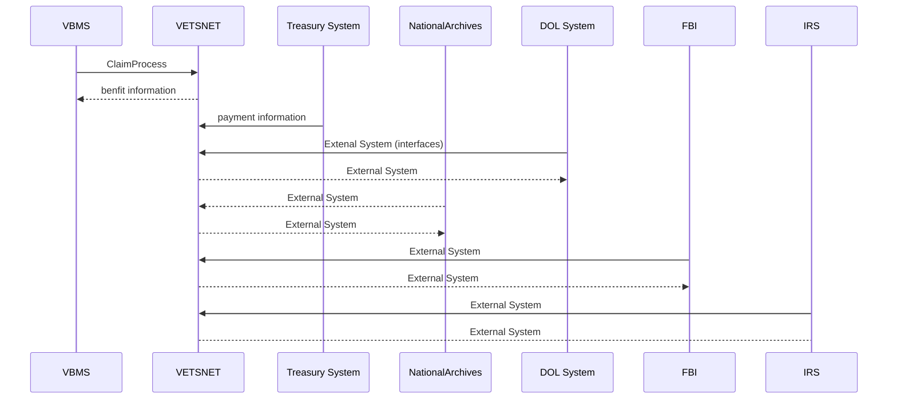

```mermaid
sequenceDiagram
    Participant VBMS
    Participant VETSNET
    Participant Treasury System
    Participant NationalArchives
    Participant DOL System
    VBMS ->> VETSNET: ClaimProcess
    VETSNET -->> VBMS: benfit information
    Treasury System ->> VETSNET:  payment information
    DOL System ->> VETSNET :Extenal System (interfaces)
    VETSNET -->> DOL System : External System
    NationalArchives -->> VETSNET : External System
    VETSNET -->> NationalArchives: External System
    FBI ->> VETSNET : External System
    VETSNET -->> FBI : External System
    IRS->> VETSNET : External System
    VETSNET --> IRS: External System
```
