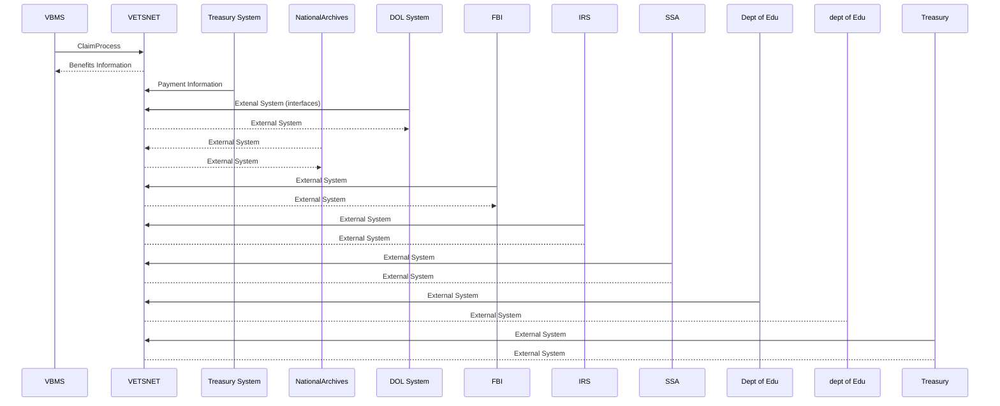

```mermaid
sequenceDiagram
    Participant VBMS
    Participant VETSNET
    Participant Treasury System
    Participant NationalArchives
    Participant DOL System
    VBMS ->> VETSNET: ClaimProcess
    VETSNET -->> VBMS: Benefits Information
    Treasury System ->> VETSNET:  Payment Information
    DOL System ->> VETSNET :Extenal System (interfaces)
    VETSNET -->> DOL System : External System
    NationalArchives -->> VETSNET : External System
    VETSNET -->> NationalArchives: External System
    FBI ->> VETSNET : External System
    VETSNET -->> FBI : External System
    IRS->> VETSNET : External System
    VETSNET --> IRS: External System
    SSA->> VETSNET : External System
    VETSNET --> SSA: External System
    Dept of Edu->> VETSNET : External System
    VETSNET --> dept of Edu: External System 
    Treasury ->> VETSNET : External System
    VETSNET --> Treasury: External System
```
